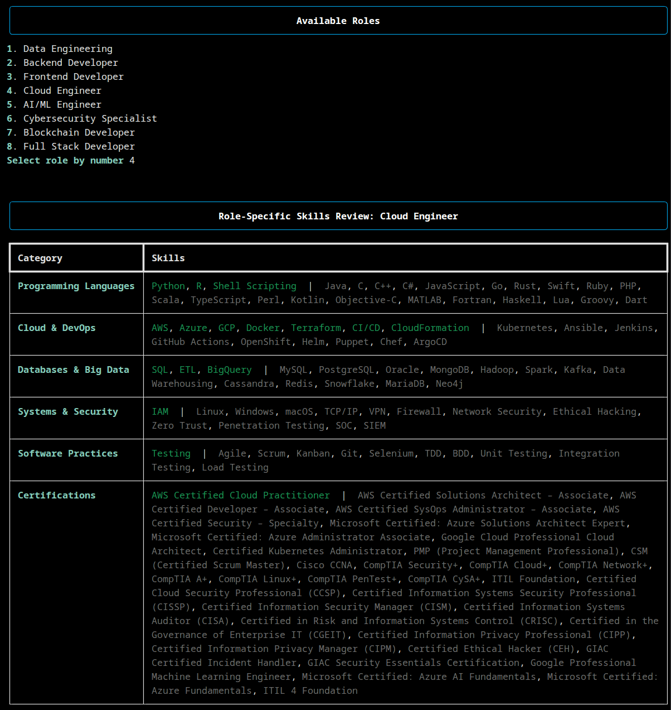

<h1 align="center">📄 Resume Parser </h1>
<p align="center"><em>See your technical resume exactly how recruiters and ATS tools see it — and get clear, actionable feedback.</em></p>

<div align="center">

[](LICENSE)
[](https://www.python.org/)
[](https://medium.com/@saraprettyman)
[](https://buymeacoffee.com/saraprettyman)


</div>

<div><br><br></div>

## 💡 Why This Exists
ATS and recruiter software often strip away **formatting, bullets, and design elements** — leaving a plain-text version of your resume that can look very different from the PDF you submit. **Resume Parser** reveals that hidden view so you can improve based on facts, not guesswork. Runs entirely **offline** — your data never leaves your machine.


This is a project by **Digital Resume Solutions LLC**, created with a privacy-first approach.


## 🚀 Features
- **ATS text view** – See the raw text an ATS extracts.  
- **Skills check** – Detect missing job-specific keywords & tech skills.  
- **Recruiter preview** – View a clean, parsed version of your resume.  
- **Formatting audit** – Spot lost layout, bullets, or special chars.  
- **Privacy-first** – 100% local processing.

## 🔍 Why Not Use Free Online ATS Scanners?
| Free Online Scanners | **Resume Parser** |
|----------------------|-------------------|
| Uploads your private resume to the cloud | Runs 100% offline on your machine |
| Opaque algorithms | Transparent, open-source code |
| Limited control over data retention | You keep total control |
| Requires subscription, limited # of scans | Unlimited scans — completely free, no catch |


## 📦 Installation

```bash
# Clone the repository
git clone https://github.com/saraprettyman/resume_parser.git
cd resume_parser

# Create a virtual environment (recommended)
python -m venv .venv
source .venv/bin/activate  # or .venv\Scripts\activate on Windows

# Install dependencies
pip install -e .

```

## 🚀 Launch interactive mode
```bash
python -m resume_parser.cli
```

You’ll be guided through:
1. Selecting your resume
2. Choosing analysis modes (ATS, Skills)
3. Viewing results in your terminal

## ✅ Skills Checker
<div align="center">
  
</div>  

Scan your resume for **general** or **role-specific** skills from a curated dataset.  
See what’s recognized — and what’s missing.

## 🛠  Development
For local development with tests:
```bash
# Create and activate environment
python -m venv .venv
source .venv/bin/activate

# Install dev dependencies
pip install -r requirements-dev.txt

# Run tests
pytest
```
We welcome contributions. If you’d like to add a feature or fix a bug, open an issue or submit a pull request.

## 📂 Project Structure
```
.
├── 📄 environment.yml               # Conda environment setup
├── 📜 LICENSE
├── ⚙️ pyproject.toml                 # Build & tooling config
├── 📘 README.md
├── 📄 requirements.txt               # Runtime dependencies
├── 📄 requirements-dev.txt           # Dev/test dependencies
├── 📦 setup.py                       # Package installer
├── 📂 resume_parser/                 # Main package
│   ├── __init__.py
│   ├── 🚀 main.py                     # Entry point
│   ├── 💻 cli.py                      # CLI interface
│   ├── 📂 config/
│   │   └── 📜 patterns.py             # Regex & parsing patterns
│   ├── 📂 data/
│   │   └── 📊 skills_master.json      # Master skills dataset
│   ├── 📂 extractors/                 # Resume section parsers
│   │   ├── 🏗️ base_extractor.py
│   │   ├── 📇 contact_extractor.py
│   │   ├── 🎓 education_extractor.py
│   │   ├── 💼 experience_extractor.py
│   │   └── 📝 summary_extractor.py
│   └── 📂 utils/                      # Helper utilities
│       ├── 🖥️ display.py
│       ├── 📂 file_reader.py
│       ├── 🔍 regex_helpers.py
│       ├── 📍 section_finder.py
│       ├── 🛠️ skills_checker.py
│       ├── 📋 skills_list_loader.py
│       └── ✏️ text_normalizer.py
└── 🧪 tests/                          # Test suite
    ├── 🛠️ conftest.py
    ├── 📂 data/
    │   ├── 🖼️ cli_screenshot_1.png
    │   ├── 🖼️ cli_screenshot_2.png
    │   └── 📂 fake_resumes/
    │       └── 📄 fake_resume.pdf
    ├── 🧪 test_cli_integration.py
    ├── 🧪 test_contact_extractor.py
    ├── 🧪 test_education_extractor.py
    ├── 🧪 test_experience_extractor.py
    └── 🧪 test_skills_checker.py
```

## 🗺 Roadmap (High-Impact Features First)
* **Resume vs Job Description Match Score**: Keyword overlap %, missing skills, ATS tips.
* **Web Interface**: Drag-and-drop resume analysis in the browser.
* **Career Change Resume Translator**: Maps skills from one industry to equivalent terms in another.
* **Open Resume Benchmark**: Aggregate anonymous resume data to reveal top skills by industry & role.


## 📜 License
This project is licensed under the GPLv3 License.

Created by Digital Resume Solutions LLC
If you find this useful, [Buy Me a Coffee](https://buymeacoffee.com/saraprettyman) to support continued development.

