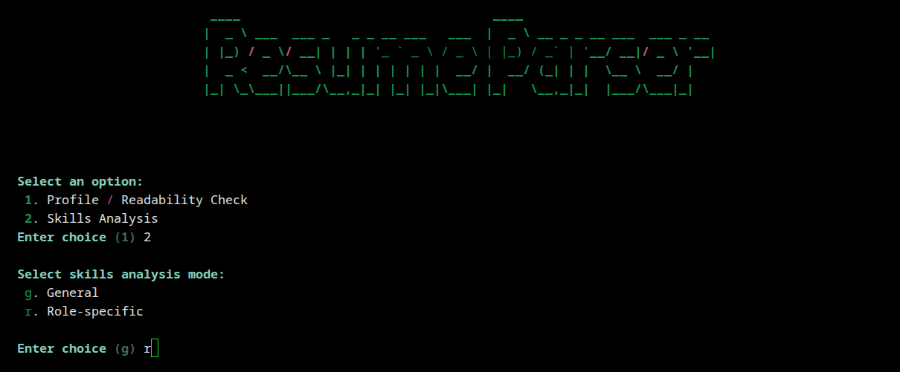

# Resume Parser  
_See your technical resume the way recruiters and ATS tools do — and get clear, constructive feedback._

[](LICENSE)
[](https://www.python.org/)
[](https://buymeacoffee.com/saraprettyman)


## Why this exists
Hiring software can be a black box. Applicant Tracking Systems (ATS) and recruiters both see a version of your resume that may look *very* different from what you carefully designed.  
**Resume Parser** was built to pull back that curtain.

Instead of chasing myths about “beating the ATS,” this tool helps you:
- See what the software actually reads
- Understand what a human sees after parsing
- Make changes based on facts, not folklore

This is a project by **Digital Resume Solutions LLC**, created with a privacy-first approach. Everything runs locally on your machine — your data never leaves your computer.

---

## What it does
- **ATS text view** – Extracts the raw text an ATS would see from your PDF or DOCX resume.  
- **Missing skill detection** – Highlights job-relevant keywords and technologies you forgot to include.  
- **Recruiter perspective** – Shows a clean, readable format after parsing.  
- **Formatting check** – Pinpoints where PDFs lose layout, bullets, or special characters.  
- **Offline mode** – Works without internet; perfect for sensitive data.

---

## Example
<p float="center">
  <br>
  <br>
</p>

---

## Installation

```bash
# Clone the repository
git clone https://github.com/yourusername/resume_parser.git
cd resume_parser

# Create a virtual environment (recommended)
python -m venv .venv
source .venv/bin/activate  # or .venv\Scripts\activate on Windows

# Install dependencies
pip install -e .
```

## Launch interactive mode
```bash
python -m resume_parser.cli
```

You’ll be guided through:
* Selecting your resume file
* Choosing analysis modes (ATS, recruiter view, skills check)
* Viewing results directly in your terminal

## Development
For local development with tests:
```bash
python -m resume_parser.cli
```
We welcome contributions. If you’d like to add a feature or fix a bug, open an issue or submit a pull request.

## Roadmap
* Web interface for drag-and-drop uploads
* Side-by-side diff view of original vs parsed text
* Job posting integration for direct keyword comparison
* Chrome extention

## License
This project is licensed under the GPLv3 License.

Created by Digital Resume Solutions LLC
If you find this useful, Buy Me a Coffee to support continued development.

